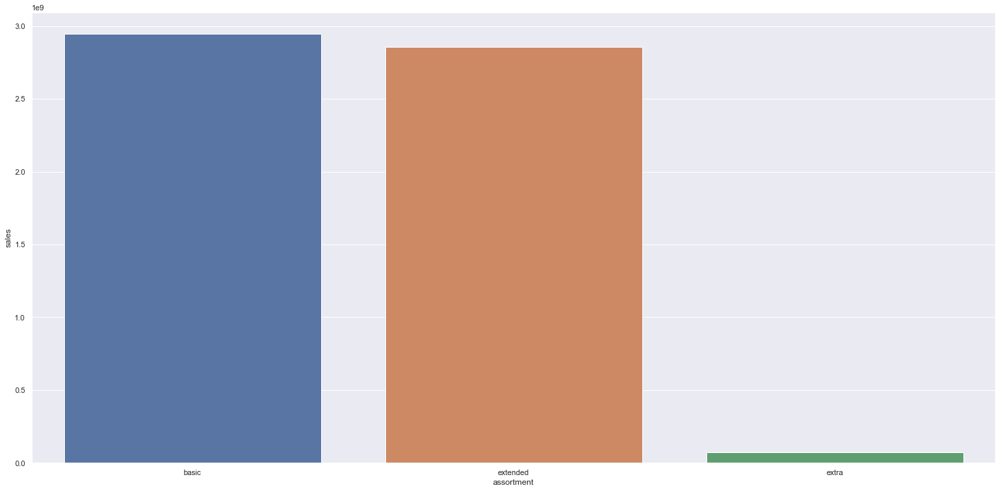
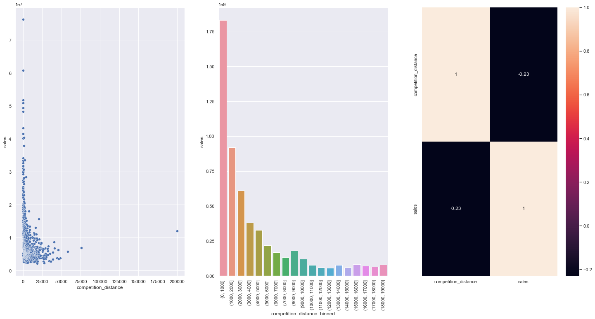
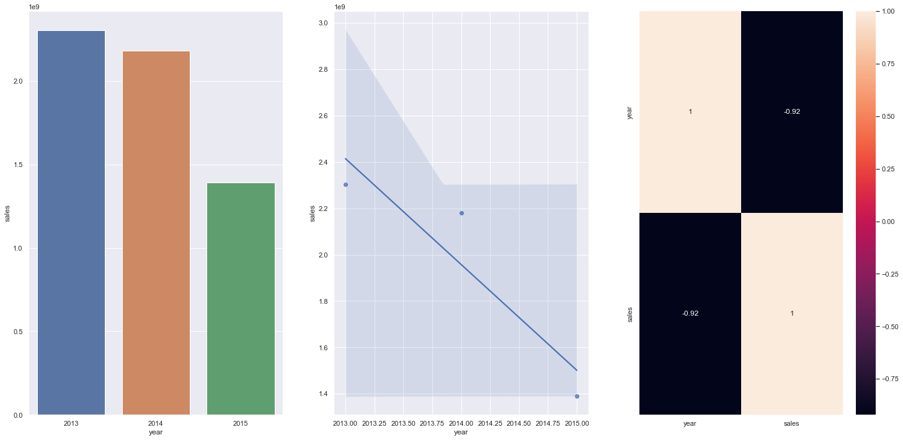
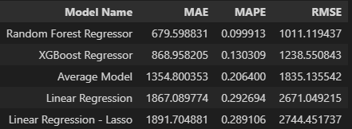
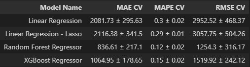
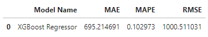
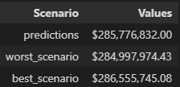
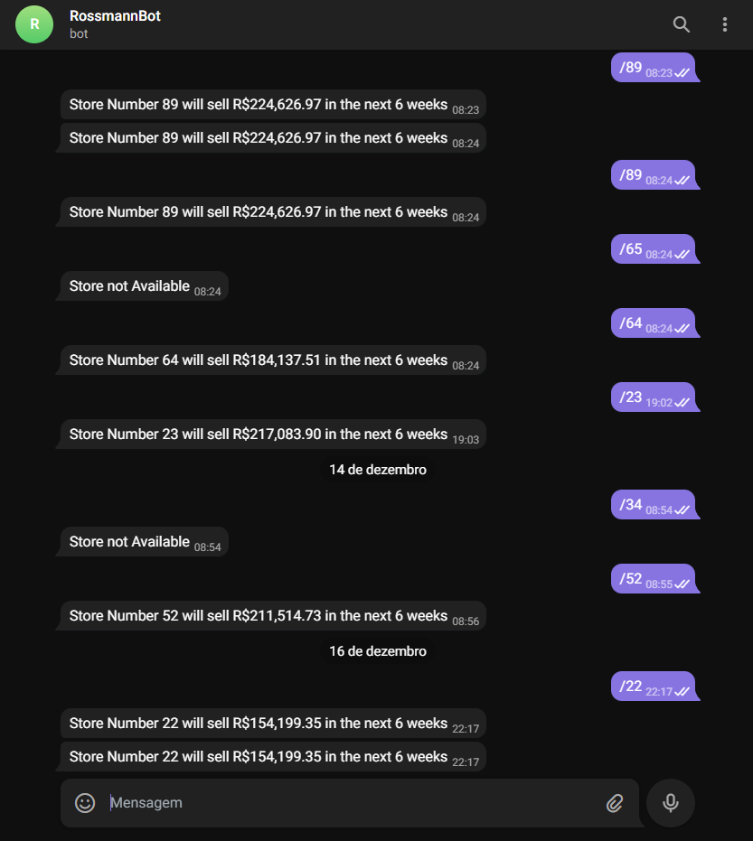

# Rossmann
<b>AVISO:</b> Todos os problemas e premissas contextualizados no projeto são fictícios. Seu único objetivo é dar sentido para o desenvolvimento da solução.  
# Previsão de vendas das drogarias Rossmann
Este é um projeto de previsão de vendas, onde foi utilizado ferramentas de Machine Learning para resolução do problema. 
  

    

 

## 1. Sobre a Rossmann
A Rossmann é uma das maiores redes de drogaria da Europa, com cerca de 56.200 funcionários e mais de 4.000 lojas em diversos países, como Alemanha, Polônia, Hungria, República Tcheca, Turquia, Albânia, Kosovo e Espanha. É uma empresa com um grande sortimento de produtos que são oferecidos as seus clientes, incluindo produtos próprios. A companhia está em grande expansão e num ritmo elevado, com grandes investimentos.
  
### 1.1. Problema de negócio
O projeto foi desenvolvido a partir da necessidade do CFO da empresa em destinar orçamento para reforma das lojas da rede. Visto que é necessário saber quanto as lojas irão vender para dimensionar o investimento da reforma, o produto de dados de previsão de vendas foi o que mais se destacou para sanar a dor do CFO.
  
### 1.2. Premissas do negócio
- Os dias em que as lojas estão fechadas serão removidos da análise
- Apenas lojas abertas e que possuam vendas serão consideradas
- Para lojas que não possuem competidor próximo, será considerado uma distância muito maior do que a máxima presente nos dados analisados
  

### 1.3. Sobre os dados
| Atributos                        | Descrição                                                    |
| -------------------------------- | ------------------------------------------------------------ |
| Id                               | Um Id que representa uma dupla (Store, Date) dentro do conjunto de teste |
| Store                            | Um id único para cada loja                                   |
| Sales                            | O volume de vendas para qualquer dia                         |
| Customers                        | O número de clientes em um determinado dia                       |
| Open                             | Um indicador para saber se a loja estava aberta: 0 = fechada, 1 = aberta |
| StateHoliday                     | Indica um feriado estadual. Normalmente todas as lojas, com poucas exceções, fecham nos feriados estaduais. Observe que todas as escolas fecham nos feriados e finais de semana. a = feriado, b = feriado da Páscoa, c = Natal, 0 = Nenhum |
| SchoolHoliday                    | Indica se (Loja, Data) foi afetado pelo fechamento de escolas públicas |
| StoreType                        | Diferencia entre 4 modelos de loja diferentes: a, b, c, d  |
| Assortment                       | Descreve um nível de estoque: a = básico, b = extra, c = estendido |
| CompetitionDistance              | Distancia em metros do competidor mais proximo           |
| CompetitionOpenSince[Month/Year] | Dá o ano e mês aproximados em que o concorrente mais próximo foi aberto |
| Promo                            | Indica se uma loja está fazendo uma promoção naquele dia         |
| Promo2                           | Promo2 é uma promoção contínua e consecutiva para algumas lojas: 0 = a loja não está participando, 1 = a loja está participando |
| Promo2Since[Year/Week]           | Descreve o ano e a semana em que a loja começou a participar da Promo2 |
| PromoInterval                    | Descreve os intervalos consecutivos de início da promoção 2, nomeando os meses em que a promoção é iniciada novamente. Por exemplo. "Fev, maio, agosto, novembro" significa que cada rodada começa em fevereiro, maio, agosto, novembro de qualquer ano para aquela loja |

  

## 2. Estratégia de solução
O projeto foi desenvolvido através do método CRISP-DM, aplicando os seguintes passos:

**Passo 01 - Descrição dos Dados:** Nessa etapa, o objetivo foi conhecer os dados, seus tipos, usar métricas estatísticas para identificar outliers no escopo do negócio e também analisar métricas estatísticas básicas como: média, mediana, máximo, mínimo, range, skew, kurtosis e desvio padrão. Nessa etapa também foram feitos alguns ajustes em features do dataset, como preenchimento de NA's por exemplo.

**Passo 02 - Feature Engineering:** Nessa etapa, foi desenvolvido um mapa mental para analisar o fenômeno, suas variáveis e os principais aspectos que impactam cada variável. A partir disso, foi derivado novos atributos com base nas variáveis originais para descrever melhor o fenômeno que será modelado.

**Passo 03 - Filtragem de Variáveis:** O objetivo desta etapa foi filtrar linhas e excluir colunas que não são relevantes para o modelo ou não fazem parte do escopo do negócio, como por exemplo, desconsiderar dias que as lojas não estavam operando e que não houveram vendas.

**Passo 04 - Análise Exploratória de Dados:** O objetivo desta etapa foi explorar os dados para encontrar insights, entender melhor a relevância das variáveis no aprendizado do modelo. Foram feitas analises univariadas, biváriadas e multivariadas, utilizandos os dados numéricos e categóricos do conjunto.

**Passo 05 - Preparação dos Dados:** Nessa etapa,  os dados foram preparados para o inicio das aplicações de modelos de machine learning. Foram utilizadas técnicas como Rescaling e Transformation, através de encodings e nature transformation.

**Passo 06 - Seleção de Variáveis:** O objetivo desta etapa foi selecionar os melhores atributos para treinar o modelo. Foi utilizado o algoritmo Boruta para fazer a seleção das variáveis, destacando as que tinham mais relevância para o fenômeno.

**Passo 07 - Machine Learning Modeling:** Nessa etapa foi feito os testes e treinamento de alguns modelos de machine learning, onde foi possível comparar suas respectivas performance e feita a escolha do modelo ideal para o projeto. Inclusive foi utilizada a técnica de Cross Validation para garantir a performance real sobre os dados selecionados.

**Passo 08 - Hyperparameter Fine Tunning:** Tendo a escolha do algorotimo XBoost na etapa anterior, foi feita uma analise através do método Randon Search para escolher os melhores valores para cada um dos parâmetros do modelo. Ao final dessa etapa foi possível obter os valores finais da performance do modelo.

**Passo 09 - Tradução e Interpretação do Erro:** O objetivo dessa etapa foi de fato demonstrar o resultado do projeto, onde foi possível avaliar a performance do modelo com o viés de negócio, demonstrando o resultado financeiro que pode ser esperado se aplicado o modelo desenvolvido.

**Passo 10 - Deploy do Modelo em Produção:** Após execução bem sucedida do modelo, o objetivo foi publica-lo em um ambiente de nuvem para que outras pessoas ou serviços possam usar os resultados para melhorar a decisão de negócios. A plataforma de aplicativo em nuvem escolhida foi o Heroku.
  

## 3. Top insights
### **H1.** Lojas com maior sortimento deveriam vender mais.
**FALSA** - Lojas com maior **SORTIMENTO** vendem **MENOS**
  

  
### **H2.** Lojas com competidores mais proximos deveriam vender menos.
**FALSA** - Lojas com competidores **MAIS PRÓXIMOS** vendem **MAIS**
  

  
### **H8.** Lojas deveriam vender mais ao longo dos anos.
**FALSA** Lojas vendem **MENOS** ao longo dos anos.
  

  

## 4. Modelos utilizados
- Média;
- Regressão Linear;
- Regressão Linear com Regularização (Lasso);
- Random Forest Regressor;
- XGBoost Regressor.
  

## 5. Performance

### 5.1. Performance única dos modelos

  

### 5.2. Performance real dos modelos - Cross Validation

  

### 5.3. Performance XGBoost - Final

  

### 5.4. Performance de negócio

  

## 6. Conclusão
Considerando o primeiro ciclo do CRISP-DS, o modelo final apresentou um desempenho aceitável, com um MAPE (Erro Médio Percentual Absoluto) de 10,3%. Sendo assim, podendo colocá-lo em produção. 
É possível acessar o modelo através de um bot no telegram, com hospedagem no heroku, basta clicar no ícone do telegram abaixo.  

   

  

## 7. Lições aprendidas
- Nem sempre o melhor modelo é o que apresenta um menor erro;
- O modelo de média pode representar um fenômeno melhor que um algoritmo de machine learning;
- Uma boa EDA e um Cross Validation correto são de extrema importância para a solução do problema.
  

## 8. Próximos passos
- Criar novas hipóteses de negócio;
- Aprofundar mais na análise exploratória de dados de acordo com as hipóteses;
- Trabalhar pontualmente nas lojas que tiveram um outlier em suas previsões nesse primeiro ciclo;
- Estudar a viabilidade da implementação de um modelo de predição de customer. Para o estudo irei utilizar o esforço x impacto da previsão da feature.
  
